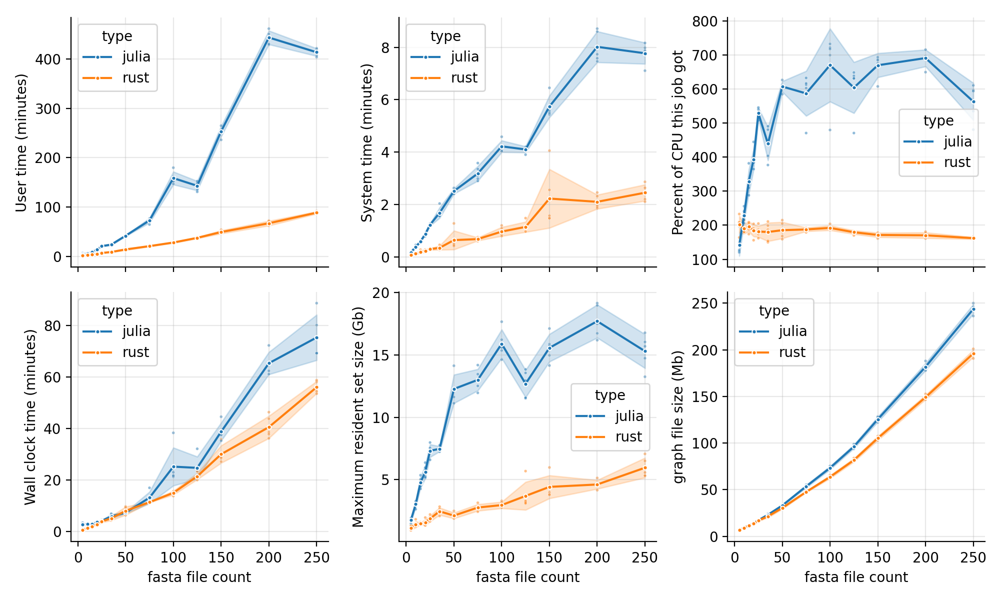

# benchmark for new pangraph rust implementation

## setup

**binaries:**
- the `pangraph` binary should be available in the path. This corresponds to the old julia version.
- the `pangraph_rust` binary should be available in the root folder of the repository. This corresponds to the new rust implementation.

Alternatively, changes in name or location of the binaries should be added to [the snakefile](snakefile) in the corresponding rules.

**datasets:**
- the `data` folder should contain fasta files with accession numbers specified in the [config file](config.yaml). E.g. file `data/NC_013654.1.fa` for accession number `NC_013654.1`.

## running the pipeline

Running the pipeline requires [snakemake](https://snakemake.readthedocs.io/en/stable/) v8+.
The pipeline is designed to run on a slurm cluster (see the [profile file](profiles/cluster/config.v8+.yaml)). It can be run with:

```sh
snakemake --profile profiles/cluster all
```

## results

The pipeline produces the two benchmark summary images below, together with [a summart table](results/summmary.csv).



